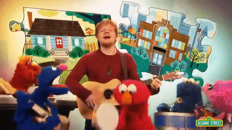
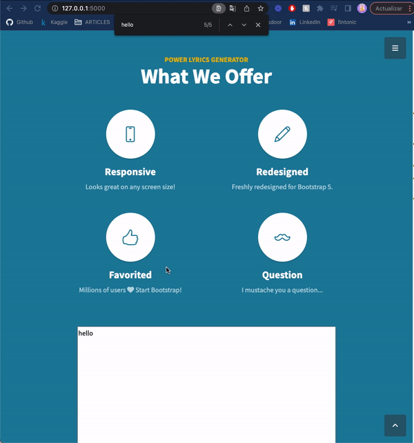
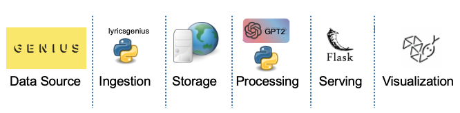

# My Muppet is a Songwriter 
<p align="center">

</p>

## Project Motivation
Our Natural Language Processing professor, Angel Castellanos Gonzalez, has proposed us a challenge. Create an application that should address an actual use case scenario. Some people in our group play instruments and we have even tried to write songs, with unfortunate results, specially to our audience (family and friends) that were expecting a new Lady Gaga and Freddie Mercury in the room and after few songs realizing that maybe we should think of doing something else. Should we abandon our dreams?.

## Solution
A novel musician, real artists and the entire music industry are under pressure to generate higher output more quickly. Harnessing creativity and overcoming songwriters’ blocks when writing lyrics and music pieces are challenging. Our solution is helping artists create song texts more efficiently.

## Abstract
Natural Language Generation (NLG) has made incredible strides in recent years. In early 2019, OpenAI released GPT-2, a huge pretrained model (1.5B parameters) capable of generating text of human-like quality.

Generative Pretrained Transformer 2 (GPT-2) is, like the name says, based on the Transformer. It therefore uses the attention mechanism, which means it learns to focus on previous words that are most relevant to the context in order to predict the next word (for more on this, go here).

The goal of this repo is to show you how you can fine-tune GPT-2 to generate lyrics, based on the data you provide to it and the inputs. The idea is then to use the already trained GPT-2  model, fine-tune it to our specific data and then, based on what the model observes, generate what should follow in any given song.

## Playground 
Link of the pythonanywhere and explanation:

Link to Video and Playaround with flask into our localhost:
https://drive.google.com/file/d/1aBEZE9hB_up5bFhLl4G5OtRgU-uxWwEl/view?usp=sharing
Genius_token:v_DlIr3iACp5OnOalr7mzNahsb5UlysGmKKS1VzDJAfJCxvJdIB4_k0A2jJeLnvo

<p align="center">

</p>

## Structure

<p align="center">

</p>


### 1- Data Source

If you have an account in Spotify, I´ll probably have heard of Genius. Genius is a website that allows users to provide annotations and interpretation to song lyrics, news stories, sources, poetry, and documents.

Spotify has had a partnership with Genius since 2016 on their "Behind the Lyrics" feature, which displays lyrics and content from Genius for select tracks, allowing users to "watch annotated lyrics for songs as you listen to them".

For this project we will use the [Genius.com API](https://genius.com/api-clients) to get the lyrics from the selected artist that we need to finetune the model. However, the very first milestone is to create an account into the developer site of Genius API, this will provide us with the access token or credentials required. Once we get to this point, let´s analyze what our code will do.


```python
    from flask import Flask,render_template, request
    # Using request to set the inputs coming from the html
    genius_access_token=request.form['GENIUS_ACCESS_TOKEN']
    # Set environment variables so the API will read this credentials
    os.environ['GENIUS_ACCESS_TOKEN'] = genius_access_token
```

In this first approach we will keep it simple but in the next version we will source [Spotify API](https://developer.spotify.com/dashboard/applications) so the user gains the feature of playing with the different parameters, such as the danceability, the energy and so on... that Spotify opens for exploration into their API.


### 2- Ingestion
Instead of calling directly the Data Source, which requires a good understanding of the Genius.com API documentation, we will take a more friendly approach by leveraging [Lyricsgenius](https://lyricsgenius.readthedocs.io/en/master/), a python wrapper for the Genius.com API that simplifies the job.

First, lets include the customized inputs:
- **Artist**: Choose a well-known band or outstanding artist to help us finishing the lyrics of your song. You can include more than one if you want a mix of songwriters.
- **Max_Songs**: Choose how many songs does the model need (0-99) to study the behaviour of the artist. Our recommendation is to use 1-5 as the training will be longer as the number of tokens of the train_dataet increase.

```python
    # Using request to set the inputs from the html
    input_lyrics=request.form['message']
    artist=request.form['ARTIST']
    max_songs=request.form['MAX_SONGS']
    
    # Convert strings into list 
    artists = (Convert(artist))
    max_songs = int(max_songs)
```
Creating our genius object specifying the following parameters:
- **genius_access_token**: Lyricsgenius needs the credentials to utilize the Genius API.
- **skip_non_songs**: Include only songs in our search. Skiping podcasts, soundtracks...
- **excluded_terms**: To avoid duplicates, the dataset needs to digest new songs and we can prevent that by removing the different versions for a single song filtering the songs containing words like "Remix", "Live" or "Demo" included in the name of the song.
- **remove_section_headers**: It is not recommendable to feed the model with the name of the song but just the lyrics.

```python
    #our genius_object
    genius = lg.Genius(genius_access_token,
                        skip_non_songs=True,
                        excluded_terms=["Remix", "Live","Demo", "(Remix)", "(Live)"],
                        remove_section_headers=True)
```

Once we have the genius.com object, we are going to specify with the method ```search_artist```, the name of the artist and the number of songs sorted by popularity. Then we will grab these songs and write it down in a txt file, this is part of the storage section but in here are combined into the **get_lyrics** function.

```python
    def get_lyrics(arr, k):  # Write lyrics of k songs by each artist in arr
        c = 0  # Counter
        for name in arr:
            try:
                songs = (genius.search_artist(name, max_songs=k, sort='popularity')).songs
                s = [song.lyrics for song in songs]
                file.write("\n \n  \n \n".join(s))
                c += 1
                print(f"Songs grabbed:{len(s)}")
            except:  #  Broad catch which will give us the name of artist and song that threw the exception
                print(f"some exception at {name}: {c}")


    #Specify the artists
    get_lyrics(artists, max_songs)
```
As mentioned before, in version2, this project will receive an upgrade by getting the information coming from Spotify, as we have already had a first hand experience with it on a previous Spark project, we can tell in advance that the intention is to facilitate the ingestion through  [Spotipy](https://spotipy.readthedocs.io/en/2.9.0/) a python wrapper for the Spotify API.

### 3- Storage

Before building up the **get_lyrics** function we will need to create the file in which we will dump the lyrics. This file will be stored in the webserver and it will be created as a blank sheet everytime the user runs the prediction.
```python
    # Set up the file to write lyrics to (.txt) and erease previous content
    file = open('train_dataset.txt', 'r+')
    file.truncate(0)
```

### 4- Processing
We need to do some cleaning of the dataset before moving to the next step. In this code snippet, we are removing a piece of text that after the end of the lyrics its placed, (two digits) followed by ("Embed"). 

```python
    # Some Cleaning
    # Read file.txt
    with open('train_dataset.txt', 'r+') as file:
        text = file.read()
    # Delete text and Write
    with open('train_dataset.txt', 'w') as file:
        # Delete
        new_text = re.sub('\d{2}Embed', '',text)
        # Write
        file.write(new_text)
```
Now we are ready! Let´s do some NLP. But the first question is... **Why did we choose GPT-2?** Because it is easy to fine-tune, doesn´t need a key-value pair like the "prompt-completion" in GPT-3, plenty of resources and documentation that leverage this model with similar use cases, GPT-2 is well designed for text generation given a dataset with text while other models do not contain this feature and are more useful for other use cases such as classification, question-answer... Our clear shoot here was downloading first a small version of GPT-2 as we do not need a larger one for this educational purpose. 

```python
    # Download the small version of GPT2
    #pip install gpt_2_simple
    gpt2.download_gpt2(model_name='124M')

    # Prepare the train_set
    file_name = 'train_dataset.txt'
```
Let´s get our hands dirty! Or not... because we just need around 10 lines of code to finetune GPT-2. Check-out the parameters we have chosen following best practises.

```python
    ## Finetune the model

    #model_name: model downloded
    #steps: number of epocs
    #sample_every: Number of steps to print example output
    #print_every: Number of steps to print training progress
    sess = gpt2.start_tf_sess()
    gpt2.finetune(sess,
                dataset=file_name,
                model_name='124M',
                steps=20,
                restore_from='fresh',
                run_name='run1',
                print_every=10,
                sample_every=20,
                )
```
Fine-tuning GPT-2 requires time, as we do not have GPU power we just need a call for patience for our dearly users (estimated time 20 mins). But once we are there, we will generate 5 samples with several proposals writen by our favourite songwriter/artist.

```python
    ## Run_test with some parameters

    #lenght: number of tokes to generate.
    #temperature: randomness in the model.
    #prefix: start from this particular sentence.
    #top_k: Number of words considered at each step(token).
    output= gpt2.generate(sess,
                length=250,
                temperature=0.7,
                prefix=input_lyrics,
                nsamples=5,
                top_k=40,
                return_as_list=True)
    #Converting list into a string
    output_string = ''.join(output)
```

### 5- Serving
Among other backend frameworks such as Django and FastAPI, we decided to go after Flask for the sake of simplicity, as it is one of the veterans frameworks there is more documentation and community and last but not least because we have worked with this package in the past, so we are more familiar with it.

The structure is very simple:
- create a .py which by convention used to be name as "app.py".
- initiate the app with the name of the folder in which the html is located.
- route the app to the .html to be render.
- Set the POST method to yield the predictions on the page. In this function is where we integrate all of the above code (inside the "..."), and return the prediction inside of the html. 
```python
app = Flask(__name__,template_folder="templates")

@app.route("/")
#@app.route("/home")
def home():
    return render_template("index.html")


#Set a post method to yield predictions on page
@app.route('/', methods = ['POST'])
def predict():
    ...
    return render_template('index.html', prediction_text=output_string)
if __name__=="__main__":
    app.run(debug=True)
```
Before running this, we should accomodate our .html to the prediction. See a piece of code below with this specific part.

```html
<!---Set placeholder for prediction output--->
<div class ="pred">
    <p class = "result" style="white-space: pre-wrap"><b>{{ prediction_text }}</b>
        </p>
    </div>
```

### 6- Visualization
We will deploy our Fask app using Pythonanywhere, 

### Sources
- [How to Fine-Tune GPT-2 for Text Generation](https://towardsdatascience.com/how-to-fine-tune-gpt-2-for-text-generation-ae2ea53bc272)
- [GPT-2 Artificial Intelligence Song Generator](https://blog.ml6.eu/gpt-2-artificial-intelligence-song-generator-lets-get-groovy-3e7c1f55030f)
- [How to Leverage Spotify API + Genius Lyrics for Data Science Tasks in Python](https://medium.com/swlh/how-to-leverage-spotify-api-genius-lyrics-for-data-science-tasks-in-python-c36cdfb55cf3)
- [Text Generation With Python And GPT-2](https://towardsdatascience.com/text-generation-with-python-and-gpt-2-1fecbff1635b)
- [Understanding the GPT-2 Source Code Part 1](https://medium.com/analytics-vidhya/understanding-the-gpt-2-source-code-part-1-4481328ee10b)
- [GPT2 fine tuning | gpt2 text generation | harry potter novel generation gpt2](https://www.youtube.com/watch?v=DNLebQ_vYiw&ab_channel=ProgrammingHut)
- [Deploying with Flask using Pythonanywhere](https://www.youtube.com/watch?v=5jbdkOlf4cY&ab_channel=PrettyPrinted)


### Who are we?
IE Students of the MSc Business Analytics & Big Data. Team Power Rangers:
  - Isobel Rae Impas
  - Jan P. Thoma
  - Nikolas Artadi
  - Camila Vasquez
  - Santiago Alfonso Galeano
  - Miguel Frutos

Made with ❤️ by Team Power Rangers
